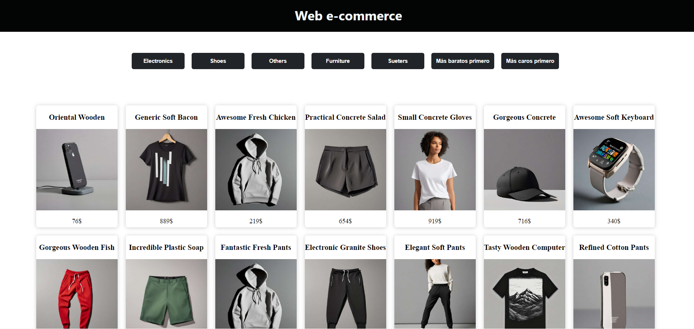
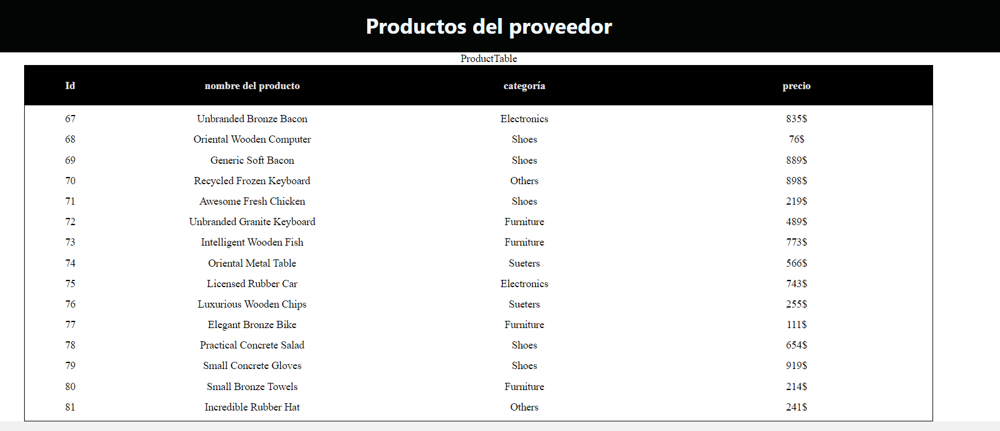

## PROYECTO E-COMMERCE

http://localhost:3000/PUBLIC

### Aplicación para Clientes:

Diseño visualmente atractivo y simple para el acceso de los clientes.
Ofrecerá una lista de productos con capacidades de ordenación y filtrado por categorías.
*Consumo API con base de datos falsa creada para este fin y disponible en la carpeta del proyecto: FakeStoreAPI*

http://localhost:3000/PARTNER

### Aplicación para el Proveedor:

La aplicación destinada al proveedor mostrará una tabla con productos y paginación
Diseño sencillo para mostrar el catálogo de productos.
Utilizada principalmente por el proveedor.

### Herramientas Utilizadas:
El proyecto ha sido construido utilizando:

- HTML5: Para la estructura principal del proyecto.
- CSS: Para estilos que proporcionan una presentación atractiva y amigable.
- JavaScript: Para funcionalidades interactivas y dinámicas.
- React: Para construir interfaces de usuario modernas y eficientes.
